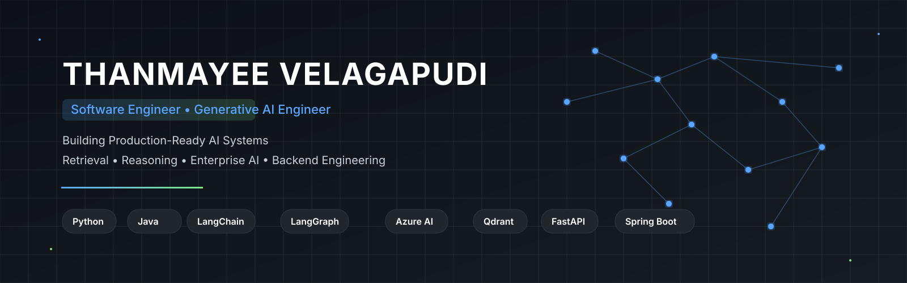

<!-- ===================================================== -->
<!--                     HERO SECTION                       -->
<!-- ===================================================== -->

<p align="center">
  
</p>

<br>

<h1 align="center">Thanmayee Velagapudi</h1>

<h3 align="center">
Software Engineer • AI & LLM Engineer
</h3>

<p align="center">
Building Production-Ready AI Systems
</p>

<p align="center">
Retrieval • Reasoning • Enterprise AI • Backend Engineering
</p>

<br>

<p align="center">

<a href="https://github.com/thanmayeevelagapudi">

</a>

<a href="https://www.linkedin.com/in/thanmayee-velagapudi/">

</a>

<a href="https://leetcode.com/u/thanmayee02/">

</a>

<a href="mailto:thanmayeevelagapudi@gmail.com">

</a>

</p>

---

# About

AI-focused Software Engineer with experience building production-oriented backend applications and intelligent systems powered by Large Language Models (LLMs). Passionate about Retrieval-Augmented Generation (RAG), enterprise document intelligence, vector search, and scalable AI architectures.

I enjoy designing systems that combine robust backend engineering with modern AI capabilities to solve real-world business problems—from enterprise search and document understanding to agentic workflows and knowledge retrieval.

---

# Engineering Focus

<table>

<tr>

<td width="50%">

### AI Engineering

- Retrieval-Augmented Generation (RAG)
- Enterprise AI Applications
- LLM Workflows
- Agentic AI Systems
- Prompt Engineering
- AI Evaluation & Observability

</td>

<td width="50%">

### Backend Engineering

- REST API Development
- Microservices
- FastAPI
- Spring Boot
- System Design
- Cloud-Native Applications

</td>

</tr>

</table>

---

# Professional Interests

<table>

<tr>

<td>

🧠 Enterprise AI Systems

</td>

<td>

📄 Document Intelligence

</td>

<td>

🔍 Semantic Search

</td>

</tr>

<tr>

<td>

🤖 LLM Applications

</td>

<td>

⚡ Backend Engineering

</td>

<td>

☁ Azure Cloud

</td>

</tr>

</table>

---


# GitHub Activity

<div align="center">


</div>

---

# Achievements

<div align="center">


</div>

---

# Open Source Philosophy

> **Build systems that solve real problems.**
>
> I enjoy designing scalable backend architectures and production-ready AI applications that combine Retrieval-Augmented Generation (RAG), Large Language Models (LLMs), and cloud-native engineering to create practical solutions for enterprise use cases.

---

# Let's Connect

<div align="center">

<a href="https://github.com/thanmayeevelagapudi">

</a>

&nbsp;&nbsp;&nbsp;

<a href="https://www.linkedin.com/in/thanmayee-velagapudi/">

</a>

&nbsp;&nbsp;&nbsp;

<a href="https://leetcode.com/u/thanmayee02/">

</a>

&nbsp;&nbsp;&nbsp;

<a href="mailto:thanmayeevelagapudi@gmail.com">

</a>

</div>

<br>

<div align="center">

### Thanks for stopping by!

Building intelligent systems through software engineering, Generative AI, and modern backend technologies.

If you're interested in collaborating on AI, backend engineering, or open-source projects, feel free to connect.

</div>

---

<div align="center">


</div>
```

---
